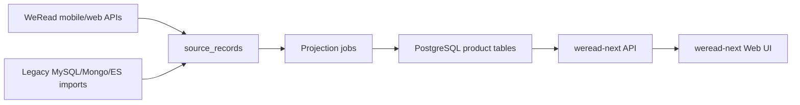

# Architecture

## Direction

Use PostgreSQL as the system of record for product reads and sync projections.
Legacy sources are preserved in `source_records`, while UI-facing tables stay
normalized enough for fast filtering and search.

## Backend Shape

The backend should be a small read/write API over PostgreSQL:

- shelf query endpoint with pagination, sorting, and filters
- book detail endpoint with normalized data plus raw evidence links
- booklist/archive endpoints
- sync-run endpoint to start and inspect sync jobs
- match-candidate endpoint for future Douban comparison work

The backend should not call old MySQL, MongoDB, or Elasticsearch during normal
requests. Those systems are migration inputs only.

## Frontend Shape

The frontend should be a dense library-management application:

- persistent left navigation for Shelf, Booklists, Archives, Purchases, Matches, Sync
- table-first shelf view with optional cover grid mode
- compact filter bar and saved filter presets
- detail drawer for fast inspection without losing list context
- explicit sync status panel

Avoid landing-page composition. This is an operational tool for a large library.

## Sync Shape

Every sync step must save raw responses first:

1. fetch current shelf IDs
2. fetch current book details in batches
3. save raw source records
4. project to `weread_items`, archives, booklists, progress, and related tables
5. report counts and gaps

The current confirmed high-volume path is `i.weread.qq.com` with mobile `skey`.

